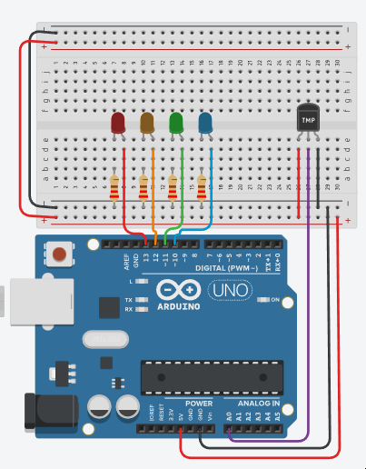

# Arduino Temperature

## 1. Designing the circuit

- Connect your temperature sensor (e.g., a thermistor or any analog temperature sensor) to analog pin A0.

- Connect four LEDs (with appropriate current-limiting resistors) to digital pins 10, 11, 12, and 13 for blue, green, orange, and red, respectively.
  - You can change the LEDs colour by clicking on it and change the colour 

- The resistance value can be changed on the resistors by clicking them, set them to 220 
- Upload the code to your Arduino board using the Arduino IDE.

- Open the Serial Monitor in the Arduino IDE to view the ADC value, temperature, and voltage readings.

- Observe how the LEDs change based on the temperature range.

- This code provides a simple temperature monitoring system with visual LED indicators. The LEDs will change their state according to the detected temperature.

<div align=center>



</div>

## 2. Define Constants and Variables

- `const int tempPin = A0`: Specifies the analog pin (A0) where the temperature sensor is connected.

- `const int redLED = 13, orangeLED = 12, greenLED = 11, blueLED = 10`: Define the digital pins for four LEDs.

- `int adcValue;`, `float voltage, temperature;`: Variables to store the analog-to-digital converter (ADC) reading, voltage, and temperature values.

```c++
const int tempPin = A0;
const int redLED = 13, orangeLED = 12, greenLED = 11, blueLED = 10;
int adcValue;
float voltage, temperature;
```

## 3.  Setup Function: 

- Set the `pinMode` for `tempPin` as `INPUT` since it's used to read the analog sensor.

- Set the `pinMode` for `redLED`, `orangeLED`, `greenLED`, and `blueLED` as `OUTPUT` to control the LEDs.

- Initialize the serial communication at a baud rate of 9600 to enable data logging and debugging.

```c++
void setup()
{
  pinMode(tempPin,INPUT);
  
  pinMode(redLED,OUTPUT);
  pinMode(orangeLED,OUTPUT);
  pinMode(greenLED,OUTPUT);
  pinMode(blueLED,OUTPUT);
  
  Serial.begin(9600); // bits per second AKA Baud Rate
}
```

## 4. Loop Function:

To code the loop function you need to do the following: 

- Read the analog value from `tempPin` using `analogRead` and store it in `adcValue`.
- Calculate the temperature using a formula and store it in temperature.
- Calculate the voltage using the ADC value and store it in `voltage`.
- Call the `tempIndicator` function to control the LED indicators based on the temperature.
- Print the `adcValue`, `temperature`, and `voltage` to the serial monitor for monitoring.
- Add a short `delay(500)` of 500 milliseconds for smoother display updates.

```c++
void loop()
{
    adcValue = analogRead(tempPin);  // Read the analog value from tempPin.
    
    // Calculate temperature and voltage based on the ADC reading.
    temperature = ((adcValue * (5.0 / 1024 )) - 0.5) / 0.01;
    voltage = (5.0 / 1024) * adcValue;
    
    // Call the tempIndicator function to control LED indicators.
    tempIndicator(temperature);
  
    // Print ADC value, temperature, and voltage to the serial monitor.
    Serial.print("ADC: ");
    Serial.print(adcValue);
    Serial.print("  | Temp: ");
    Serial.print(temperature, 2);
    Serial.print("  |  Voltage: ");
    Serial.print(voltage, 3);
    Serial.println("V");
    
    delay(500);  // Add a short delay for smoother display updates.
}
```

## 5. `tempIndicator()` Function:

The tempIndicator(temperature); placed in the loop() coded out above, functionality needs to be written. Outside the loop() functions final `}` create a new line and reproduce the following code:

```c++
void tempIndicator(float L_temp)
{
  // Control LEDs based on the temperature range.
  if (L_temp <= 5.0)
  {
    digitalWrite(redLED, LOW);
    digitalWrite(orangeLED, LOW);
    digitalWrite(greenLED, LOW);
    digitalWrite(blueLED, HIGH);
  }
  else if (L_temp > 5.0 && L_temp <= 20.0)
  {
    digitalWrite(redLED, LOW);
    digitalWrite(orangeLED, LOW);
    digitalWrite(greenLED, HIGH);
    digitalWrite(blueLED, LOW);
  }
  else if (L_temp > 20.0 && L_temp <= 30.0)
  {
    digitalWrite(redLED, LOW);
    digitalWrite(orangeLED, HIGH);
    digitalWrite(greenLED, LOW);
    digitalWrite(blueLED, LOW);
  }
  else if (L_temp > 30)
  {
    digitalWrite(redLED, HIGH);
    digitalWrite(orangeLED, LOW);
    digitalWrite(greenLED, LOW);
    digitalWrite(blueLED, LOW);
  }
}
```

- This function takes the calculated temperature as an argument `(L_temp)`.
- It uses a set of conditional statements to control the LEDs based on the temperature range:
    - If `L_temp` is less than or equal, `<=`, to 5.0, it turns on the blue LED.
    - If `L_temp`is between 5.0 and 20.0, `>= && <=`, it turns on the green LED.
    - If `L_temp` is between 20.0 and 30.0, `>= && <=` ,it turns on the orange LED.
    - If `L_temp` is greater than 30.0, `>`, it turns on the red LED.


