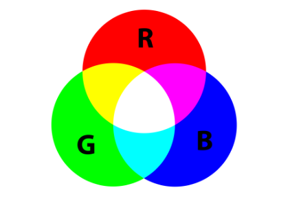
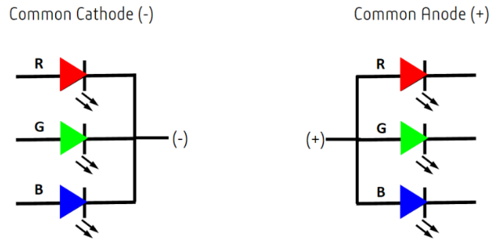
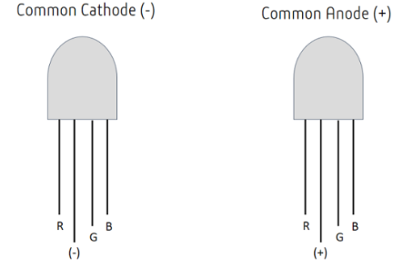
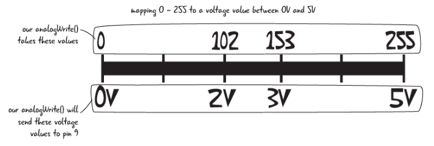

# Multi Coloured LED

## 1. Introduction 

In today’s activity we will use an Arduino with and RGB LED to create a range of colours by using different PWM values via code.

> The primary tool for this project will be TinkerCad -> [https://www.tinkercad.com](https://www.tinkercad.com)
-------------------

## 2. Some Theory...

Using an RGB LED you can produce other colors, you can combine these three colors in different intensities. To adjust the intensity of each LED you can use a PWM signal.

Because the LEDs are very close to each other, our eyes see the result of the combination of colors, rather than the three colors individually.

To have an idea on how to combine the colors, take a look at the following chart. This is the simplest color mixing chart, but gives you an idea how it works and how to produce different colors.





### 2.1 Common Anode and Common Cathode RGB LEDs

There are two kinds of RGB LEDs: common anode LED and common cathode LED. The figure below illustrates a common anode and a common cathode LED.



In a common cathode RGB LED, all three LEDs share a negative connection (cathode). In a common anode RGB LED, the three LEDs share a positive connection (anode).

This results in an LED that has 4 pins, one for each LED, and one common cathode or one common anode.

### 2.2 RGB LED Pins

RGB LEDs have four leads—one for each LED and another for the common anode or cathode. You can identify each lead by its length, as shown in the following figure.



With the LED facing you so the anode or cathode (the longest lead) is second from the left, the leads should be in the following order: red, anode or cathode, green, and blue.


## 2. Circuit

Reproduce the following ciruit, using a cathode RGB LED and 3x 220 \\(\Omega\\) resistors.


## 3. Code

Now you need to reporduce the following code:


```c++
// Define Pins
#define bluePin 3
#define greenPin 5
#define redPin 6

void setup()
{ // setting the three defined pins as output
  pinMode(redPin, OUTPUT);
  pinMode(greenPin, OUTPUT);
  pinMode(bluePin,OUTPUT);
  // setting the pins to be Red On, green and blue Off
  digitalWrite(redPin, HIGH);
  digitalWrite(greenPin, LOW);
  digitalWrite(bluePin, LOW);
}

void loop()
{
  setColour(255, 0, 0);  // red
  delay(1000); // wait a second
  setColour(0, 255, 0);  // green
  delay(1000);
  setColour(0, 0, 255);  // blue
  delay(1000);
  setColour(255, 255, 0);  // yellow
  delay(1000);  
  setColour(80, 0, 80);  // purple
  delay(1000);
  setColour(0, 255, 255);  // aqua
  delay(1000);
}

// takes three integers, for red, green and blue uses 
// the analogWrite function on each pin to change the colour based
// on those supplied values.
void setColour(int red, int green, int blue)
{
  analogWrite(redPin, red);
  analogWrite(greenPin, green);
  analogWrite(bluePin, blue);  
}
```

Run the code see how the RGB transistions between different colours. 

You can change the colour of the LED by setting the values of `setColour(int red, int green, int blue)` ie `setColour(10,50,200)` and see what produces. Remember **Only** the code in the `void loop(){...}` happens continously so this where you'd add extra colours. 

Consider modifying the `delay()` arguments to see if you can get different speeds. `delay(1000)` is one second, `delay(10)` is 0.010 seconds and so on.

## 4. 16 Million Colours...

So now you have a basic colour shifter, you can go a head a programme all 16 million colours, manually... you have 5 minuets!

Actually, what you are going to do is automate this using a bit of maths and conditioning. 

First off underneath the line that says `#define redPin 6` you need to added the following to define some variables that will be used to make this possible.

```c++
#define redPin 6

//variables to hold our colour intensities and direction
//and define some initial "random" values to seed it
int red             = 254;
int green           = 1;
int blue            = 127;
int red_direction   = -1;
int green_direction = 1;
int blue_direction  = -1;
```

Now you are to replace the code within side the `void loop(){...}`

```c++
void loop()
{
  red = red + red_direction;   //changing values of LEDs
  green = green + green_direction;
  blue = blue + blue_direction;

}
```

Explanation: 
 - `red` currently holds the value `254`
 - likewise `red_direction`  holds `-1`
 - \\(\therefore \\) `red = red + red-direction` \\(\Rightarrow\\)`253 = 254 + -1`

Continue with adding code underneath `blue = blue + blue_direction`:

```c++

  blue = blue + blue_direction
  
 
  //now change direction for each color if it reaches 255
  if (red >= 255 || red <= 0)
  {
    red_direction = red_direction * -1;
  }
  if (green >= 255 || green <= 0)
  {
    green_direction = green_direction * -1;
  }
  if (blue >= 255 || blue <= 0)
  {
    blue_direction = blue_direction * -1;
  }

  setColour(red, green, blue);
  delay(100);    //a little delay is needed so you can see the change

}
```

Explanation:

1. `if (red >= 255 || red <= 0)` 
   - the conitional statement checks first to see if the variable `red` is greater than or equal to `>=` `255`.

2. the symbols `||` is the the pipe key twice `|` usually next to the `z` key on UK keyboards. This means logical **OR**, that is to say that either side of this comparsion check must evaluate as `true` in order to execute the code in it's block.

3. the other side shows that `red` is less than or equal  `<=` to `0`

>**Note:**
>>
>> Remember that we are using the Pulse width modulation(PWM) pins of the Arduino. The PWM pins (~6,~5 and ~3) out put a signal from 0-255 is mapped to 0v and 5v.
>> 

4. `red_direction = red_direction * -1;`
   - is interesting right? It's a little maths that changes the direction by which the `red` changes (increments/decrements).
   - the first time \\(\Rightarrow 1 = (-1) * (-1) \\) 
   - the second time \\(\Rightarrow -1 = (1) * (-1) \\) 
   - the third time \\(\Rightarrow 1 = (-1) * (-1) \\) 
   - the forth time \\(\Rightarrow -1 = (1) * (-1) \\) 
   - and so on... 
  
5. the same for `green` and `blue`

6. Currently the `delay` is set to 5ms, try to experiment with this from 0 to 1000 and see if you can see all 16 million shades?!?!